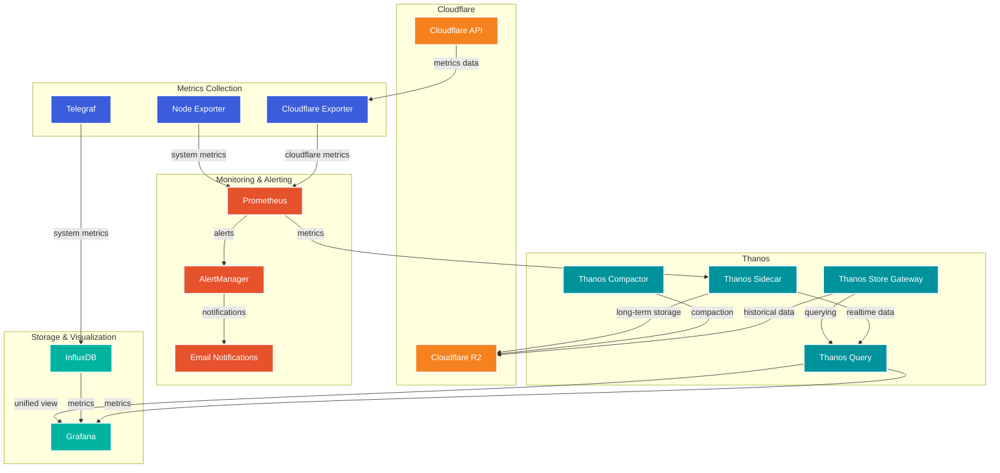
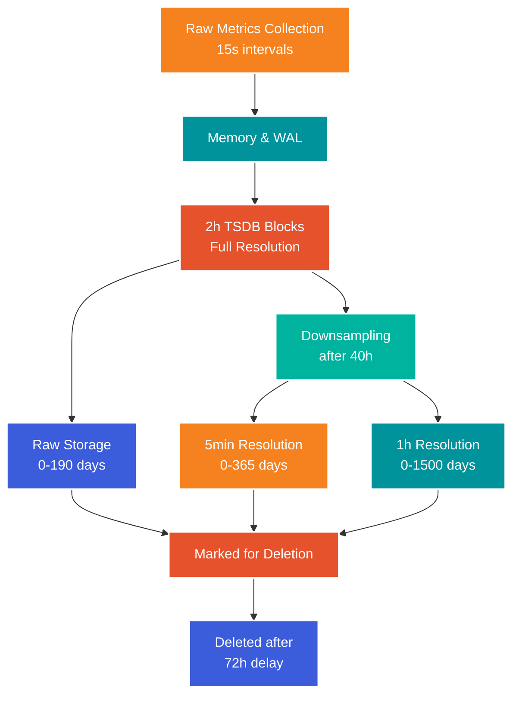

# k6 & Cloudflare Monitoring Stack

This repository outlines my comprehensive monitoring stack designed to support performance testing with [k6](https://k6.io/) and Cloudflare Analytics monitoring for multiple Cloudflare domain zones within a Cloudflare account for Cloudflare HTTP Traffic, WAF Firewall, Workers, R2 S3 storage and Cloudflare Tunnel metrics. Though you will need a Cloudflare Pro plan or higher account if you want full analytics overview. It integrates several powerful tools, including [Prometheus](https://prometheus.io/), [Thanos](https://thanos.io/), [InfluxDB](https://www.influxdata.com/products/influxdb/), [Grafana](https://www.influxdata.com/products/influxdb/), and various exporters, to offer a scalable and robust solution for collecting, storing, and visualizing metrics.

## Table of Contents

- [Features](#features)
- [Architecture](#architecture)
- [Prerequisites](#prerequisites)
- [Getting Started](#getting-started)
  - [Clone the Repository](#clone-the-repository)
  - [Configure Environment Variables](#configure-environment-variables)
  - [Launch the Stack](#launch-the-stack)
- [Services](#services)
  - [Prometheus](#prometheus)
  - [Thanos](#thanos)
    - [Thanos Sidecar](#thanos-sidecar)
    - [Thanos Store Gateway](#thanos-store-gateway)
    - [Thanos Query](#thanos-query)
    - [Thanos Compactor](#thanos-compactor)
  - [InfluxDB](#influxdb)
  - [Telegraf](#telegraf)
  - [Grafana](#grafana)
  - [Node Exporter](#node-exporter)
  - [Cloudflare Exporter](#cloudflare-exporter)
- [Usage](#usage)
  - [Accessing Grafana](#accessing-grafana)
  - [Running k6 Tests](#running-k6-tests)
- [Customization](#customization)
- [Troubleshooting](#troubleshooting)
- [Contributing](#contributing)
- [License](#license)

---

## Features

- **Scalable Metrics Storage**: Utilize Thanos components for long-term storage and horizontal scalability storing metrics in Cloudflare R2 S3 compatible object storage.
- **Rich Visualization**: Grafana dashboards for real-time and historical data analysis.
- **Integration with k6**: Seamless support for performance testing metrics (https://github.com/centminmod/k6-benchmarking).
- **Cloudflare Integration**: Collect metrics from Cloudflare using the [Cloudflare exporter](https://hub.docker.com/r/cyb3rjak3/cloudflare-exporter) and for Cloudflare Tunnels https://developers.cloudflare.com/cloudflare-one/tutorials/grafana/.
- **System Monitoring**: Node Exporter and Telegraf for comprehensive system metrics.
- **Alert Management**: Integrated AlertManager for sophisticated alert handling and email notifications.

## Architecture



Metrics flow:



Thanos Cloudflare R2 uploaded Prometheus metrics block metadata index `meta.json`

```json
{
  "ulid":  "01JBH7622RBKWQ3KPG5ND0S7NA",
  "minTime":  1730365241349,
  "maxTime":  1730368800000,
  "stats":  {
    "numSamples":  2922258,
    "numSeries":  7268,
    "numChunks":  12063
  },
  "compaction":  {
    "level":  1,
    "sources":  [
      "01JBH7622RBKWQ3KPG5ND0S7NA"
    ]
  },
  "version":  1,
  "thanos":  {
    "labels":  {
      "monitor":  "k6-support",
      "replica":  "prometheus-1"
    },
    "downsample":  {
      "resolution":  0
    },
    "source":  "sidecar",
    "segment_files":  [
      "000001"
    ],
    "files":  [
      {
        "rel_path":  "chunks/000001",
        "size_bytes":  2297271
      },
      {
        "rel_path":  "index",
        "size_bytes":  841280
      },
      {
        "rel_path":  "meta.json"
      }
    ],
    "index_stats":  {
      
    }
  }
}
```

The stack consists of the following components:

1. **Prometheus**:
   - **Role**: Prometheus is the main monitoring and alerting toolkit in my setup. It scrapes metrics from various exporters and services, storing the time-series data in its local storage.
   - **Functionality**: Prometheus operates by pulling metrics at regular intervals from "exporters" (such as Node Exporter and Cloudflare Exporter) and HTTP endpoints. It supports flexible queries and alerting rules, allowing you to set conditions for alert generation.
   - **Storage and Retention**: Prometheus has a short-term storage design, which is ideal for recent data but less suited for long-term historical data storage. In my setup, Thanos extends Prometheus to provide a durable, scalable solution for longer retention.

2. **Thanos Sidecar**:
   - **Role**: The Thanos Sidecar runs alongside Prometheus, extending its capabilities by shipping Prometheus' metrics data to object storage (Cloudflare R2 in my case) for long-term retention.
   - **Functionality**: The sidecar component monitors Prometheus and uploads data to object storage once a block is complete (every 2 hours by default in Prometheus). It also provides a gRPC API, which allows the Thanos Query component to access data from the Prometheus instance.
   - **Benefits**: With Thanos Sidecar, you achieve scalable and cost-effective long-term storage without altering Prometheus. It also facilitates data federation, allowing multiple Prometheus instances to be queried together, which is particularly valuable in large, distributed environments.

3. **Thanos Store Gateway**:
   - **Role**: Thanos Store Gateway is a cache layer that retrieves and serves historical data stored in Cloudflare R2 (or other object storage).
   - **Functionality**: The Store Gateway downloads blocks on-demand from object storage and caches them locally, optimizing read performance for repeated queries on historical data. It responds to query requests made through the Thanos Query component, providing data access even after the data has aged out of Prometheus' local storage.
   - **Use Case**: This component is useful for environments where a lot of historical data needs to be queried without impacting Prometheus' performance. It enables efficient access to old data without overwhelming object storage or Prometheus.

4. **Thanos Query**:
   - **Role**: Thanos Query acts as a centralized querying layer across multiple Prometheus instances and Thanos components, providing a unified view of both real-time and historical data.
   - **Functionality**: It connects to various Thanos components (like Sidecar and Store Gateway) and aggregates data across all connected sources. This allows users to query data from multiple Prometheus instances as if they were a single dataset.
   - **Benefits**: Thanos Query enables high availability and redundancy in metric querying. If one Prometheus instance is down, Thanos Query can still fetch data from other instances, ensuring continuity in monitoring and alerting.

5. **Thanos Compactor**:
   - **Role**: The Thanos Compactor is responsible for compacting, deduplicating, and downsampling the data stored in object storage.
   - **Functionality**: The Compactor periodically processes the stored metrics data, combining smaller data blocks into larger ones (compaction) and downsampling old data to reduce storage costs. For example, it might aggregate data points from 15-second intervals to 1-minute intervals after a certain time threshold.
   - **Benefits**: This component helps maintain manageable storage sizes, improve query performance, and ensure data retention policies are met without excessive storage usage. Downsampling old data still preserves trends while reducing storage space.

6. **InfluxDB**:
   - **Role**: InfluxDB is a time-series database optimized for high-write loads, typically used in my setup for storing k6 test results and performance metrics.
   - **Functionality**: It supports flexible schemas, fast write and query speeds, and retention policies, making it ideal for high-precision time-series data like performance metrics from load testing tools.
   - **Use Case**: In my case, InfluxDB stores results from load tests conducted with k6, separate from Prometheus, which is more suited for infrastructure metrics. This segregation allows you to optimize data handling for both types of metrics.

7. **Telegraf**:
   - **Role**: Telegraf is an agent that collects metrics from various sources and sends them to InfluxDB, acting as a bridge between data sources and InfluxDB.
   - **Functionality**: Telegraf has a broad range of plugins for collecting system metrics (CPU, memory, disk usage), application metrics, and custom metrics from k6. It can also parse data in various formats and apply transformations before writing to InfluxDB.
   - **Advantages**: By using Telegraf, you can consolidate multiple data sources into InfluxDB, allowing you to analyze load test results alongside other metrics collected from different systems.

8. **Grafana**:
   - **Role**: Grafana is a visualization tool used to create dashboards and graphs for monitoring and analysis. It aggregates data from Prometheus and InfluxDB, giving you a centralized view of all metrics.
   - **Functionality**: Grafana allows for customizable dashboards with support for querying, alerting, and real-time data updates. It supports both PromQL (Prometheus Query Language) and Flux queries for InfluxDB, giving you flexible querying capabilities across both data sources.
   - **Use Case**: With Grafana, you can create unified dashboards that visualize infrastructure metrics from Prometheus, performance metrics from InfluxDB, and data from external sources like Cloudflare, all in one interface.

9. **Node Exporter**:
   - **Role**: Node Exporter is a Prometheus exporter that exposes hardware and operating system metrics for Linux systems.
   - **Functionality**: It collects low-level system metrics such as CPU usage, memory, disk I/O, filesystem statistics, and network usage, exposing them in a format that Prometheus can scrape.
   - **Use Case**: Node Exporter provides essential insights into server health, enabling you to track system performance and identify resource bottlenecks or anomalies in real time.

10. **Cloudflare Exporter**:
    - **Role**: The Cloudflare Exporter collects metrics from Cloudflare's API, exposing them in a format that Prometheus can scrape.
    - **Functionality**: This exporter retrieves data on Cloudflare’s service metrics, such as HTTP requests, cache usage, threats detected, and other Cloudflare-specific metrics that are useful for understanding application performance and security at the edge.
    - **Advantages**: Integrating Cloudflare metrics provides visibility into web traffic and security metrics, enabling you to monitor the health and performance of my Cloudflare-protected assets alongside other infrastructure components.

11. **AlertManager**:
    - **Role**: AlertManager handles alerts sent by Prometheus, providing sophisticated alert routing, grouping, and notification delivery.
    - **Functionality**: 
      - Manages alert deduplication and grouping to prevent notification spam
      - Routes alerts to different receivers based on severity levels (critical/warning)
      - Handles email notification delivery with secure SMTP configuration
      - Supports notification throttling and silencing
    - **Features**:
      - Configurable alert grouping to reduce noise
      - Separate routing for critical and warning alerts
      - Email templates for clear, actionable notifications
      - Integration with Prometheus alert rules for:
        - Cloudflare metrics monitoring
        - System resources (CPU, memory, disk)
        - Service availability
        - Metric collection health
    - **Benefits**: 
      - Reduces alert fatigue through intelligent grouping
      - Ensures critical issues are noticed and addressed promptly
      - Provides clear, actionable notifications via email
      - Helps maintain system reliability through early warning system

## Alert Rules

Each alert category is configured with appropriate severity levels and timing thresholds to minimize false positives while ensuring timely notification of genuine issues.

The monitoring stack includes several categories of alert rules:

1. **Cloudflare Monitoring**:
   - Cloudflare exporter availability
   - Worker request staleness detection
   - Critical metric absence monitoring

2. **Infrastructure Monitoring**:
   - Host memory utilization
   - High CPU load detection
   - Disk space monitoring
   - Node availability checks

3. **Service Health**:
   - Prometheus configuration reload status
   - AlertManager configuration status
   - Target scrape health
   - TSDB compaction issues

4. **System Resources**:
   - Memory usage thresholds
   - CPU utilization limits
   - Storage capacity warnings

## Prerequisites

- **Docker** and **Docker Compose** installed on your system.
- Cloudflare account credentials for accessing R2 storage and APIs.
- Basic knowledge of Docker and container orchestration.

## Getting Started

### Clone the Repository

```bash
git clone -b cmm-cloudflare https://github.com/centminmod/k6-support.git
cd k6-support
```

### Configure Environment Variables

Create a `.env` file in the root directory and populate it with your configuration:

```bash
# InfluxDB 2.x Configuration
DOCKER_INFLUXDB_INIT_MODE=setup
DOCKER_INFLUXDB_INIT_USERNAME=admin
DOCKER_INFLUXDB_INIT_PASSWORD=your_influxdb_password
DOCKER_INFLUXDB_INIT_ORG=your_org_name
DOCKER_INFLUXDB_INIT_BUCKET=k6
DOCKER_INFLUXDB_INIT_RETENTION=1500d
INFLUX_TOKEN=your_influxdb_token
DOCKER_INFLUXDB_INIT_ADMIN_TOKEN=your_influxdb_token

# Telegraf
TELEGRAF_INFLUXDB_USER=telegraf
TELEGRAF_INFLUXDB_PASSWORD=your_telegraf_password

# Grafana Configuration
GRAFANA_ADMIN_USER=admin
GRAFANA_ADMIN_PASSWORD=your_grafana_password

# Cloudflare Configuration
CF_ACCOUNT_ID=your_cloudflare_account_id
CF_API_TOKEN=your_cloudflare_api_token
CF_ZONES=your_zone_ids  # Comma-separated list of zone IDs
R2_ACCESS_KEY_ID=your_r2_access_key
R2_SECRET_ACCESS_KEY=your_r2_secret_key
R2_BUCKET_NAME=your_r2_bucket_name

# Optional configurations
# CF_EXCLUDE_ZONES=  # Comma-separated zone IDs to exclude
# METRICS_DENYLIST=  # Comma-separated metrics to exclude

# User Credentials (for v1 compatibility)
INFLUXDB_TELEGRAF_USER=telegraf
INFLUXDB_TELEGRAF_PASSWORD=your_telegraf_password
INFLUXDB_K6_USER=k6
INFLUXDB_K6_PASSWORD=your_k6_password
INFLUXDB_PSRECORD_USER=psrecord
INFLUXDB_PSRECORD_PASSWORD=your_psrecord_password

# Database Names (for v1 compatibility)
INFLUXDB_DB_K6=k6
INFLUXDB_DB_TELEGRAF=telegraf
INFLUXDB_DB_PSRECORD=psrecord

# Network Configuration (if needed)
DOCKER_INFLUXDB_INIT_HOST=influxdb
DOCKER_INFLUXDB_INIT_PORT=8086

# Alertmanager Email Configuration for Amazon SES
ALERTMANAGER_SMTP_SMARTHOST=email-smtp.<region>.amazonaws.com:587
ALERTMANAGER_SMTP_FROM=alertmanager@yourdomain.com
ALERTMANAGER_SMTP_AUTH_USERNAME=your_ses_smtp_username
ALERTMANAGER_SMTP_AUTH_PASSWORD=your_ses_smtp_password
ALERTMANAGER_EMAIL_TO=recipient@yourdomain.com
ALERTMANAGER_EMAIL_CRITICAL_TO=critical-recipient@yourdomain.com
ALERTMANAGER_EMAIL_WARNING_TO=warning-recipient@yourdomain.com
```

**Note**:

- Replace placeholder values with your actual credentials.
- Ensure that sensitive information like passwords and tokens are kept secure and not shared publicly.

### Launch the Stack

Start the Docker Compose services:

```bash
docker compose up -d
```

This command will build and start all the services defined in the `docker-compose.yml` file.

---

## Services

### Prometheus

Prometheus is responsible for scraping metrics from various endpoints. It's configured to:

- Scrape metrics from `node-exporter`, `telegraf`, `cloudflare-exporter`, and Thanos components.
- Retain data for 2 hours to optimize storage before offloading to Thanos.

**Access Prometheus UI**: [http://localhost:9199](http://localhost:9199)

### Thanos

Thanos extends Prometheus with the following components:

#### Thanos Sidecar

- Runs alongside Prometheus.
- Uploads Prometheus data to Cloudflare R2 object storage.
- Exposes the Prometheus data to Thanos Query via gRPC.

#### Thanos Store Gateway

- Caches and serves historical data from the object storage.
- Provides scalable access to long-term metrics.

#### Thanos Query

- Aggregates data from Thanos Sidecar and Store Gateway.
- Offers a unified query interface for Grafana.

**Access Thanos Query UI**: [http://localhost:19192](http://localhost:19192)

#### Thanos Compactor

- Compacts and downsamples data in the object storage.
- Runs periodically to optimize storage and query performance.

### InfluxDB

InfluxDB stores time-series data, particularly from k6 performance tests.

- **Version**: InfluxDB 2.x
- **Initial Setup Mode**: Configured via environment variables in the `.env` file.

**Access InfluxDB UI**: [http://localhost:8186](http://localhost:8186)

### Telegraf

Telegraf collects metrics and writes them to InfluxDB. It gathers data from:

- Docker daemon.
- System stats.
- Custom metrics from k6 tests.

### Grafana

Grafana visualizes data from Prometheus and InfluxDB with pre-configured dashboards.

**Access Grafana UI**: [http://localhost:9409](http://localhost:9409)

**Default Credentials**:

- **Username**: (as set in your `.env` file, default is `admin`)
- **Password**: (as set in your `.env` file)

### Node Exporter

Node Exporter collects hardware and OS metrics, exposing them to Prometheus.

### Cloudflare Exporter

Cloudflare Exporter collects metrics from Cloudflare services and exposes them to Prometheus.

- **Environment Variables**:
  - `CF_API_TOKEN`: Your Cloudflare API token with necessary permissions.
  - `CF_ZONES`: Comma-separated list of Cloudflare zone IDs to monitor.
  - Optional: `CF_EXCLUDE_ZONES`, `METRICS_DENYLIST`.

---

## Usage

### Accessing Grafana

1. Open your browser and navigate to [http://localhost:9409](http://localhost:9409).
2. Log in using the credentials specified in your `.env` file.
3. Explore the pre-configured dashboards under the "Dashboards" section.

### Running k6 Tests

To integrate k6 with this monitoring stack:

1. Ensure your k6 scripts are configured to output metrics to InfluxDB.
2. Use the following k6 command options:

   ```bash
   k6 run --out influxdb=http://localhost:8186/orgs/your_org_name/buckets/k6 your_script.js
   ```

3. Replace `your_org_name` with the value from your `.env` file (`DOCKER_INFLUXDB_INIT_ORG`).

---

## Customization

- **Dashboards**: Add or modify Grafana dashboards located in `./config/grafana/dashboards/`.
- **Prometheus Configuration**: Adjust scrape intervals or add new targets in `./config/prometheus/prometheus.yml`.
- **Telegraf Plugins**: Enable additional Telegraf plugins in `./config/telegraf/telegraf.conf`.
- **Alerting**: Configure Grafana or Prometheus alerting rules as needed.
- **Thanos Object Storage**: The object storage configuration is located in `./config/thanos/objstore.yml`.

---

## Troubleshooting

- **Containers Not Starting**: Run `docker compose logs [service_name]` to check for errors.
- **Metrics Not Appearing**: Ensure that services are healthy and that environment variables are correctly set.
- **Permission Issues**: Verify that Docker volumes have the correct permissions. Running containers as root may resolve some permission errors but assess the security implications.
- **Cloudflare Exporter Errors**: Ensure that your Cloudflare API token and zone IDs are correct and have the necessary permissions.

---

## Contributing

Contributions are welcome! Please open an issue or submit a pull request on GitHub.

**GitHub Repository**: [https://github.com/centminmod/k6-support/tree/cmm-cloudflare](https://github.com/centminmod/k6-support/tree/cmm-cloudflare)

---

## License

This project is licensed under the MIT License. See the [LICENSE](LICENSE) file for details.

---

**Disclaimer**: Ensure that all credentials and sensitive information are securely managed and not exposed in any public repositories.